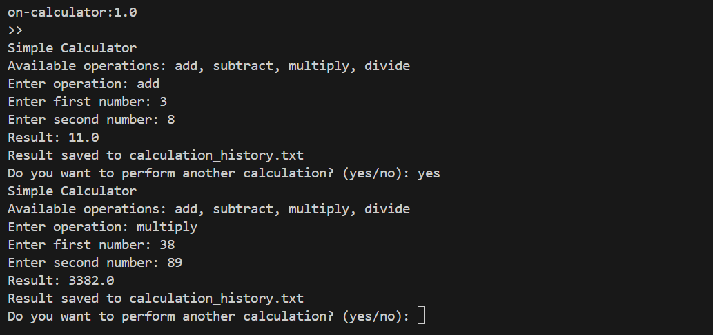

<<<<<<< HEAD
# Python Calculator with Docker

This project is a **simple Python-based calculator** application that performs basic arithmetic operations: addition, subtraction, multiplication, and division. The application runs as a **console-based** program where users can input their desired operation and numbers. The result of each calculation is displayed on the console and logged to a text file named `calculation_history.txt`.

## Setup Instructions

1. Clone the repository to your local machine.
2. Navigate to the `python-docker-app` directory.
3. Build the Docker image:
   ```bash
   docker build -t python-calculator:1.0 .
4. Run the Container: docker run -it --rm -v $(pwd)/data:/app/data --name calc-app python-calculator:1.0


## Usage
1. Enter an operation (e.g., add, subtract, multiply, divide).
2. Enter two numbers.
3. The result is displayed and saved to `data/calculation_history.txt`.

Example:
1. Enter Operation: add
2. Enter first number: 10 
3. Enter second number: 5
4. Result: 15.0 
Result saved to calculation_history.txt

## Docker Concepts
1. Base Image:The application uses `python:3.9-slim` as a lightweight base image.
2. Working Directory:The Dockerfile sets `/app` as the working directory.
3. Volume Mounting:The `-v` option is used to mount a local directory for data persistence.
4. Entry Point:The application starts with the `CMD` instruction in the Dockerfile.


## Screenshots
1. Running the application & application output:

=======
# python-docker-app
This project is a **simple Python-based calculator** application that performs basic arithmetic operations: addition, subtraction, multiplication, and division.
>>>>>>> b5c8ad732b667f2e926e18a561b766da589bf875
